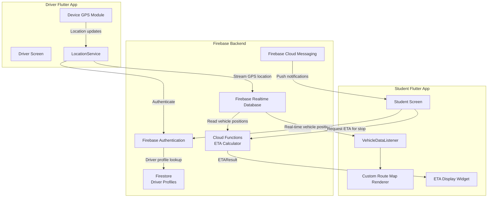
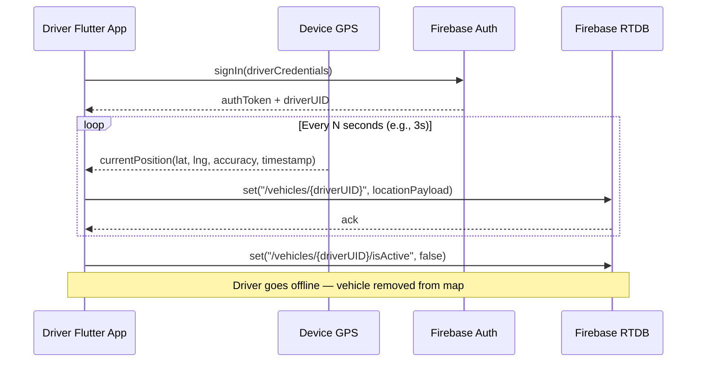
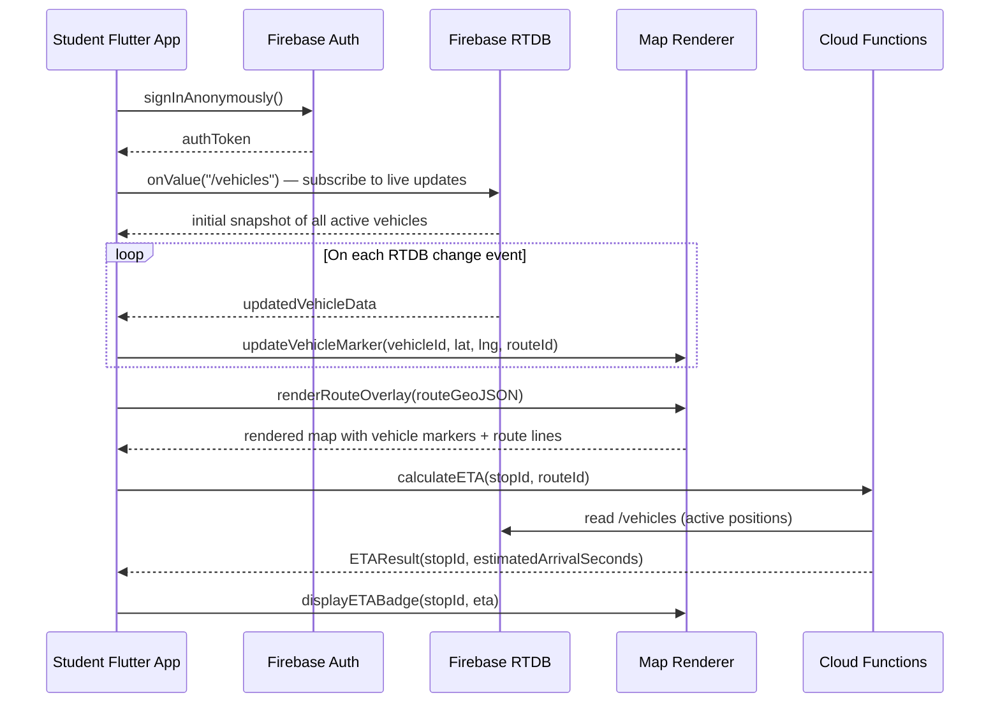

# Design Document: UST E-Jeep Transit App with Real-time GPS Tracking

## Overview

The UST E-Jeep Transit App enables private electric jeepney (E-Jeep) drivers operating near the University of Santo Tomas (UST) in Manila, Philippines to stream their live GPS location to a Firebase Realtime Database. Students and commuters can then view all active E-Jeeps on a custom-drawn route map in real time, helping them plan their commute and reduce waiting time at stops.

The system is composed of two client-facing roles — **Driver** and **Student/Passenger** — backed by a Firebase Realtime Database for live location data and Firebase Authentication for identity management. The map is rendered using a custom-drawn overlay of UST-area E-Jeep routes on top of a base map provider (e.g., Google Maps or OpenStreetMap/Leaflet).

The app targets mobile-first usage (Android/iOS) built with **Flutter**, providing a single Dart codebase for both platforms. Estimated Time of Arrival (ETA) calculations are performed server-side via **Firebase Cloud Functions**, which consume live vehicle positions from RTDB and return per-stop arrival estimates to the Flutter client.

---

## Architecture



---

## Sequence Diagrams

### Driver Location Streaming



### Student Viewing Live Map



### Driver Going Offline

```mermaid
sequenceDiagram
    participant D as Driver App
    participant RTDB as Firebase RTDB

    D->>RTDB: onDisconnect("/vehicles/{driverUID}/isActive").set(false)
    note over D,RTDB: Registered before streaming starts
    D--xRTDB: Connection lost (app closed / network drop)
    RTDB->>RTDB: Executes onDisconnect handler automatically
    note over RTDB: Vehicle marked inactive; removed from student map
```

---

## Components and Interfaces

### Component 1: Driver Location Service (Flutter)

**Purpose**: Collects GPS coordinates from the device at a configurable interval and pushes them to Firebase RTDB. Implemented as a Dart service class using the `geolocator` Flutter plugin.

**Interface**:
```pascal
INTERFACE LocationService
  PROCEDURE startStreaming(driverUID: String, routeId: String)
  PROCEDURE stopStreaming(driverUID: String)
  PROCEDURE updateInterval(seconds: Integer)
  FUNCTION getCurrentPosition(): GeoPosition
END INTERFACE
```

**Responsibilities**:
- Request and manage device location permissions via Flutter's `permission_handler` plugin
- Poll or subscribe to device GPS at a set interval (default: 3 seconds) using `geolocator`
- Throttle updates when accuracy is below threshold (e.g., > 50 m accuracy)
- Write location payload to `/vehicles/{driverUID}` in RTDB
- Register `onDisconnect` handler to mark vehicle inactive on connection loss

---

### Component 2: Vehicle Map Renderer (Flutter)

**Purpose**: Renders the custom UST E-Jeep route overlay and live vehicle markers on a base map. Implemented as a Flutter widget using the `google_maps_flutter` plugin (or `flutter_map` for OpenStreetMap).

**Interface**:
```pascal
INTERFACE MapRenderer
  PROCEDURE initializeMap(containerId: String, centerCoords: GeoPosition)
  PROCEDURE renderRouteOverlay(routes: List<RouteGeoJSON>)
  PROCEDURE addVehicleMarker(vehicle: VehicleState)
  PROCEDURE updateVehicleMarker(vehicleId: String, position: GeoPosition)
  PROCEDURE removeVehicleMarker(vehicleId: String)
  PROCEDURE fitBoundsToRoute(routeId: String)
  PROCEDURE displayETABadge(stopId: String, etaSeconds: Integer)
END INTERFACE
```

**Responsibilities**:
- Load and display a GeoJSON route overlay for each E-Jeep route near UST
- Place and animate vehicle markers as location updates arrive
- Color-code markers by route (e.g., Route A = blue, Route B = green)
- Show vehicle detail popup on marker tap (driver name, route, last updated)
- Handle marker cleanup when a vehicle goes offline
- Display ETA badges on stop markers when ETA data is available

---

### Component 3: Firebase RTDB Listener

**Purpose**: Subscribes to the `/vehicles` node in Firebase RTDB and dispatches updates to the map renderer.

**Interface**:
```pascal
INTERFACE VehicleDataListener
  PROCEDURE subscribe(onUpdate: FUNCTION(vehicles: Map<String, VehicleState>))
  PROCEDURE unsubscribe()
  FUNCTION getActiveVehicles(): List<VehicleState>
END INTERFACE
```

**Responsibilities**:
- Establish and maintain a real-time listener on `/vehicles`
- Filter out inactive vehicles (`isActive = false`) before dispatching
- Reconnect automatically on network interruption
- Provide a snapshot of current active vehicles on initial load

---

### Component 4: Authentication Service

**Purpose**: Manages sign-in flows for both drivers (email/password) and students (anonymous or email).

**Interface**:
```pascal
INTERFACE AuthService
  FUNCTION signInDriver(email: String, password: String): AuthResult
  FUNCTION signInStudentAnonymously(): AuthResult
  FUNCTION signInStudent(email: String, password: String): AuthResult
  PROCEDURE signOut()
  FUNCTION getCurrentUser(): User OR NULL
  FUNCTION isDriver(user: User): Boolean
END INTERFACE
```

**Responsibilities**:
- Authenticate drivers with email/password via Firebase Auth
- Allow students to sign in anonymously (no account required)
- Attach custom claims or Firestore role document to distinguish driver vs. student
- Enforce Firebase Security Rules so only authenticated drivers can write to `/vehicles/{their UID}`

---

### Component 5: Route Data Service

**Purpose**: Loads and caches the static GeoJSON definitions of E-Jeep routes near UST.

**Interface**:
```pascal
INTERFACE RouteDataService
  FUNCTION loadRoutes(): List<RouteGeoJSON>
  FUNCTION getRouteById(routeId: String): RouteGeoJSON OR NULL
  FUNCTION getStopsForRoute(routeId: String): List<Stop>
END INTERFACE
```

**Responsibilities**:
- Load route GeoJSON from a bundled asset or a remote config endpoint
- Cache routes locally to support offline map rendering
- Provide stop coordinates for each route (for stop markers on the map)

---

### Component 6: ETA Calculation Cloud Function

**Purpose**: A Firebase Cloud Function (Node.js/TypeScript) that computes the estimated time of arrival for a given E-Jeep at a specified stop, based on the vehicle's current live position and the route geometry stored in RTDB/Firestore.

**Interface**:
```pascal
INTERFACE ETAService
  FUNCTION calculateETA(vehicleId: String, stopId: String, routeId: String): ETAResult
  FUNCTION calculateETAForAllStops(vehicleId: String, routeId: String): List<ETAResult>
  FUNCTION getETAForStop(stopId: String, routeId: String): List<ETAResult>
END INTERFACE
```

**Cloud Function Trigger**: HTTPS Callable Function (`functions.https.onCall`)

**Responsibilities**:
- Read the current `VehicleState` for the requested vehicle from RTDB
- Load the `RouteGeoJSON` for the given `routeId` (from Firestore or bundled config)
- Project the vehicle's current position onto the route polyline to determine its progress
- Compute the remaining route distance from the vehicle's projected position to the target stop
- Estimate arrival time using the vehicle's current `speed` (or a default average speed if speed is zero or unavailable)
- Return an `ETAResult` with the estimated arrival in seconds and a confidence level
- Reject requests for inactive or stale vehicles (return `ETAResult.Unavailable`)

---

## Data Models

### VehicleState

```pascal
STRUCTURE VehicleState
  vehicleId   : String        // Firebase UID of the driver
  driverName  : String        // Display name
  routeId     : String        // e.g., "route-a", "route-b"
  latitude    : Float         // WGS84 decimal degrees
  longitude   : Float         // WGS84 decimal degrees
  accuracy    : Float         // GPS accuracy in meters
  heading     : Float         // Direction of travel in degrees (0–360)
  speed       : Float         // Speed in km/h
  timestamp   : Integer       // Unix epoch milliseconds
  isActive    : Boolean       // True while driver is streaming
END STRUCTURE
```

**Validation Rules**:
- `latitude` must be in range [-90, 90]
- `longitude` must be in range [-180, 180]
- `accuracy` must be > 0
- `timestamp` must be within the last 30 seconds to be considered "live"
- `routeId` must match a known route identifier

---

### RouteGeoJSON

```pascal
STRUCTURE RouteGeoJSON
  routeId     : String
  routeName   : String        // e.g., "UST – Espana – Quiapo"
  color       : String        // Hex color for map rendering
  geometry    : GeoJSONLineString
  stops       : List<Stop>
END STRUCTURE

STRUCTURE Stop
  stopId      : String
  name        : String        // e.g., "UST Gate 1"
  latitude    : Float
  longitude   : Float
  sequence    : Integer       // Order along the route
END STRUCTURE
```

---

### User

```pascal
STRUCTURE User
  uid         : String        // Firebase UID
  email       : String OR NULL
  displayName : String OR NULL
  role        : Enum { DRIVER, STUDENT, ANONYMOUS }
  routeId     : String OR NULL  // Assigned route (drivers only)
END STRUCTURE
```

---

### AuthResult

```pascal
STRUCTURE AuthResult
  VARIANT Success
    user      : User
    token     : String
  END VARIANT
  VARIANT Failure
    errorCode : String
    message   : String
  END VARIANT
END STRUCTURE
```

---

### ETAResult

```pascal
STRUCTURE ETAResult
  VARIANT Available
    vehicleId           : String        // Vehicle this ETA applies to
    stopId              : String        // Target stop
    routeId             : String
    estimatedArrivalSec : Integer       // Seconds until arrival (>= 0)
    distanceRemainingM  : Float         // Metres remaining along route
    confidence          : Enum { HIGH, MEDIUM, LOW }
    computedAt          : Integer       // Unix epoch ms when computed
  END VARIANT
  VARIANT Unavailable
    reason              : String        // e.g., "VEHICLE_INACTIVE", "STALE_POSITION", "STOP_PASSED"
  END VARIANT
END STRUCTURE
```

**Validation Rules**:
- `estimatedArrivalSec` must be ≥ 0
- `distanceRemainingM` must be ≥ 0
- `confidence` is `HIGH` when vehicle speed > 0 and position age < 10 s; `MEDIUM` when speed is 0 but position is recent; `LOW` when position age is between 10 s and `STALE_THRESHOLD_MS`
- `computedAt` must be within 5 seconds of the current server time

---

### RouteProgress

```pascal
STRUCTURE RouteProgress
  vehicleId           : String
  routeId             : String
  projectedLatitude   : Float         // Snapped position on polyline
  projectedLongitude  : Float
  distanceTravelledM  : Float         // Metres from route start to projected position
  totalRouteLengthM   : Float
  progressFraction    : Float         // distanceTravelledM / totalRouteLengthM ∈ [0, 1]
END STRUCTURE
```

---

## Algorithmic Pseudocode

### Main Algorithm: Driver Location Streaming Loop

```pascal
PROCEDURE startLocationStreaming(driverUID, routeId)
  INPUT: driverUID (String), routeId (String)
  OUTPUT: none (side effect — writes to RTDB continuously)

  SEQUENCE
    // Register disconnect handler BEFORE starting stream
    RTDB.onDisconnect("/vehicles/" + driverUID + "/isActive").set(false)

    // Mark driver as active
    RTDB.set("/vehicles/" + driverUID + "/isActive", true)
    RTDB.set("/vehicles/" + driverUID + "/routeId", routeId)

    WHILE driverIsOnline DO
      position ← GPS.getCurrentPosition()

      IF position.accuracy > MAX_ACCURACY_THRESHOLD THEN
        // Skip low-accuracy readings
        WAIT POLL_INTERVAL_SECONDS
        CONTINUE
      END IF

      payload ← buildLocationPayload(driverUID, routeId, position)
      RTDB.set("/vehicles/" + driverUID, payload)

      WAIT POLL_INTERVAL_SECONDS
    END WHILE

    // Explicit offline — driver ended session
    RTDB.set("/vehicles/" + driverUID + "/isActive", false)
  END SEQUENCE
END PROCEDURE
```

**Preconditions**:
- Driver is authenticated; `driverUID` is a valid Firebase UID
- `routeId` matches a known route in the route data service
- Device GPS permission has been granted
- Network connection is available

**Postconditions**:
- `/vehicles/{driverUID}` in RTDB is updated every `POLL_INTERVAL_SECONDS`
- On any disconnection, `isActive` is set to `false` via the `onDisconnect` handler
- No stale vehicle data remains visible to students after the driver goes offline

**Loop Invariant**:
- At the start of each iteration, `driverIsOnline` is `true`
- Each written payload has a `timestamp` greater than the previous iteration's timestamp

---

### Main Algorithm: Student Map Update Handler

```pascal
PROCEDURE onVehicleDataUpdate(snapshot)
  INPUT: snapshot (Map<String, VehicleState>) — from RTDB listener
  OUTPUT: none (side effect — updates map markers)

  SEQUENCE
    activeVehicles ← FILTER snapshot WHERE vehicle.isActive = true
                     AND isRecent(vehicle.timestamp)

    FOR EACH vehicle IN activeVehicles DO
      IF mapRenderer.hasMarker(vehicle.vehicleId) THEN
        mapRenderer.updateVehicleMarker(vehicle.vehicleId, vehicle.latitude, vehicle.longitude)
      ELSE
        mapRenderer.addVehicleMarker(vehicle)
      END IF
    END FOR

    // Remove markers for vehicles no longer in the active set
    currentMarkerIds ← mapRenderer.getAllMarkerIds()
    activeIds        ← MAP activeVehicles TO vehicle.vehicleId

    FOR EACH markerId IN currentMarkerIds DO
      IF markerId NOT IN activeIds THEN
        mapRenderer.removeVehicleMarker(markerId)
      END IF
    END FOR
  END SEQUENCE
END PROCEDURE
```

**Preconditions**:
- `snapshot` is a valid, non-null map from the RTDB listener
- `mapRenderer` is initialized and the route overlay is already rendered

**Postconditions**:
- All active, recent vehicles have a marker on the map
- All inactive or stale vehicles have their markers removed
- No duplicate markers exist for the same `vehicleId`

**Loop Invariant** (inner FOR loops):
- All markers processed so far accurately reflect the current snapshot state

---

### Algorithm: Build Location Payload

```pascal
FUNCTION buildLocationPayload(driverUID, routeId, position)
  INPUT: driverUID (String), routeId (String), position (GeoPosition)
  OUTPUT: VehicleState

  SEQUENCE
    ASSERT position.latitude  >= -90  AND position.latitude  <= 90
    ASSERT position.longitude >= -180 AND position.longitude <= 180
    ASSERT position.accuracy  > 0

    payload ← NEW VehicleState
    payload.vehicleId  ← driverUID
    payload.routeId    ← routeId
    payload.latitude   ← position.latitude
    payload.longitude  ← position.longitude
    payload.accuracy   ← position.accuracy
    payload.heading    ← position.heading   OR 0
    payload.speed      ← position.speed     OR 0
    payload.timestamp  ← currentTimeMillis()
    payload.isActive   ← true

    RETURN payload
  END SEQUENCE
END FUNCTION
```

**Preconditions**:
- `position` is a valid GPS fix with non-null `latitude` and `longitude`
- `accuracy` is a positive number

**Postconditions**:
- Returned `VehicleState` has all required fields populated
- `timestamp` reflects the current wall-clock time at the moment of the call

---

### Algorithm: isRecent (Staleness Check)

```pascal
FUNCTION isRecent(timestamp)
  INPUT: timestamp (Integer) — Unix epoch milliseconds
  OUTPUT: Boolean

  SEQUENCE
    ageMillis ← currentTimeMillis() - timestamp

    IF ageMillis <= STALE_THRESHOLD_MS THEN
      RETURN true
    ELSE
      RETURN false
    END IF
  END SEQUENCE
END FUNCTION
```

**Preconditions**:
- `timestamp` is a valid Unix epoch value in milliseconds
- `STALE_THRESHOLD_MS` is a positive constant (recommended: 30000 ms = 30 seconds)

**Postconditions**:
- Returns `true` if the data is fresh enough to display
- Returns `false` if the vehicle has not sent an update within the threshold

---

### Algorithm: ETA Calculation (Cloud Function)

```pascal
FUNCTION calculateETA(vehicleId, stopId, routeId)
  INPUT: vehicleId (String), stopId (String), routeId (String)
  OUTPUT: ETAResult

  SEQUENCE
    // Step 1: Fetch live vehicle state from RTDB
    vehicle ← RTDB.get("/vehicles/" + vehicleId)

    IF vehicle IS NULL OR vehicle.isActive = false THEN
      RETURN Unavailable("VEHICLE_INACTIVE")
    END IF

    IF NOT isRecent(vehicle.timestamp) THEN
      RETURN Unavailable("STALE_POSITION")
    END IF

    // Step 2: Load route geometry
    route ← RouteDataService.getRouteById(routeId)

    IF route IS NULL THEN
      RETURN Unavailable("UNKNOWN_ROUTE")
    END IF

    // Step 3: Find target stop on route
    targetStop ← route.stops.find(stop.stopId = stopId)

    IF targetStop IS NULL THEN
      RETURN Unavailable("UNKNOWN_STOP")
    END IF

    // Step 4: Project vehicle position onto route polyline
    progress ← projectOntoRoute(vehicle.latitude, vehicle.longitude, route.geometry)

    // Step 5: Compute distance from vehicle to target stop along route
    stopProgress ← projectOntoRoute(targetStop.latitude, targetStop.longitude, route.geometry)

    IF stopProgress.distanceTravelledM <= progress.distanceTravelledM THEN
      // Vehicle has already passed this stop
      RETURN Unavailable("STOP_PASSED")
    END IF

    remainingDistanceM ← stopProgress.distanceTravelledM - progress.distanceTravelledM

    // Step 6: Estimate arrival time
    effectiveSpeedMps ← vehicle.speed / 3.6   // Convert km/h to m/s

    IF effectiveSpeedMps <= 0 THEN
      effectiveSpeedMps ← DEFAULT_SPEED_MPS    // Fallback: 20 km/h = 5.56 m/s
    END IF

    estimatedArrivalSec ← ROUND(remainingDistanceM / effectiveSpeedMps)

    // Step 7: Determine confidence level
    positionAgeMs ← currentTimeMillis() - vehicle.timestamp

    IF vehicle.speed > 0 AND positionAgeMs < 10000 THEN
      confidence ← HIGH
    ELSE IF positionAgeMs < 10000 THEN
      confidence ← MEDIUM
    ELSE
      confidence ← LOW
    END IF

    RETURN Available(
      vehicleId           = vehicleId,
      stopId              = stopId,
      routeId             = routeId,
      estimatedArrivalSec = estimatedArrivalSec,
      distanceRemainingM  = remainingDistanceM,
      confidence          = confidence,
      computedAt          = currentTimeMillis()
    )
  END SEQUENCE
END FUNCTION
```

**Preconditions**:
- `vehicleId` is a non-empty string
- `stopId` is a non-empty string
- `routeId` is a non-empty string matching a known route
- RTDB is accessible from the Cloud Function runtime
- `DEFAULT_SPEED_MPS` is a positive constant (recommended: 5.56 m/s ≈ 20 km/h)

**Postconditions**:
- Returns `ETAResult.Available` with `estimatedArrivalSec ≥ 0` when the vehicle is active, recent, and has not yet passed the stop
- Returns `ETAResult.Unavailable` with a descriptive reason in all other cases
- Never returns a negative `estimatedArrivalSec`

**Loop Invariant**: N/A (no loops; uses helper `projectOntoRoute` which iterates internally)

---

### Algorithm: Project Position onto Route Polyline

```pascal
FUNCTION projectOntoRoute(latitude, longitude, geometry)
  INPUT: latitude (Float), longitude (Float), geometry (GeoJSONLineString)
  OUTPUT: RouteProgress

  SEQUENCE
    minDistanceM      ← INFINITY
    bestSegmentIndex  ← 0
    bestProjectedLat  ← latitude
    bestProjectedLng  ← longitude
    distanceTravelled ← 0
    totalLength       ← 0

    // Iterate over each segment of the polyline
    FOR i ← 0 TO geometry.coordinates.length - 2 DO
      segStart ← geometry.coordinates[i]
      segEnd   ← geometry.coordinates[i + 1]

      projected ← closestPointOnSegment(latitude, longitude, segStart, segEnd)
      distToProjected ← haversineDistance(latitude, longitude,
                                           projected.lat, projected.lng)

      IF distToProjected < minDistanceM THEN
        minDistanceM     ← distToProjected
        bestSegmentIndex ← i
        bestProjectedLat ← projected.lat
        bestProjectedLng ← projected.lng
      END IF

      totalLength ← totalLength + haversineDistance(segStart.lat, segStart.lng,
                                                      segEnd.lat, segEnd.lng)
    END FOR

    // Compute distance travelled up to the best projected point
    FOR i ← 0 TO bestSegmentIndex - 1 DO
      segStart ← geometry.coordinates[i]
      segEnd   ← geometry.coordinates[i + 1]
      distanceTravelled ← distanceTravelled + haversineDistance(segStart.lat, segStart.lng,
                                                                  segEnd.lat, segEnd.lng)
    END FOR

    // Add partial segment distance
    segStart ← geometry.coordinates[bestSegmentIndex]
    distanceTravelled ← distanceTravelled + haversineDistance(segStart.lat, segStart.lng,
                                                               bestProjectedLat, bestProjectedLng)

    RETURN RouteProgress(
      projectedLatitude   = bestProjectedLat,
      projectedLongitude  = bestProjectedLng,
      distanceTravelledM  = distanceTravelled,
      totalRouteLengthM   = totalLength,
      progressFraction    = distanceTravelled / totalLength
    )
  END SEQUENCE
END FUNCTION
```

**Preconditions**:
- `geometry.coordinates` has at least 2 points
- `latitude` ∈ [-90, 90], `longitude` ∈ [-180, 180]

**Postconditions**:
- `progressFraction` ∈ [0, 1]
- `distanceTravelledM` ≥ 0 and ≤ `totalRouteLengthM`
- The returned projected point lies on the route polyline

**Loop Invariant**:
- After each iteration `i`, `distanceTravelled` equals the sum of segment lengths from index 0 to `i-1` plus the partial distance within segment `i` to the best projected point found so far

---

### Algorithm: Authentication Flow

```pascal
PROCEDURE authenticateUser(role, email, password)
  INPUT: role (Enum { DRIVER, STUDENT }), email (String OR NULL), password (String OR NULL)
  OUTPUT: AuthResult

  SEQUENCE
    IF role = DRIVER THEN
      IF email IS NULL OR password IS NULL THEN
        RETURN Failure("MISSING_CREDENTIALS", "Email and password required for drivers")
      END IF

      result ← FirebaseAuth.signInWithEmailAndPassword(email, password)

      IF result IS Failure THEN
        RETURN Failure(result.errorCode, result.message)
      END IF

      user ← result.user
      user.role ← DRIVER

      RETURN Success(user, result.token)

    ELSE IF role = STUDENT THEN
      result ← FirebaseAuth.signInAnonymously()

      IF result IS Failure THEN
        RETURN Failure(result.errorCode, result.message)
      END IF

      user ← result.user
      user.role ← ANONYMOUS

      RETURN Success(user, result.token)
    END IF
  END SEQUENCE
END PROCEDURE
```

**Preconditions**:
- Firebase Auth is initialized
- For `DRIVER` role: `email` and `password` are non-empty strings

**Postconditions**:
- On success: returns a valid `AuthResult.Success` with a populated `User` and token
- On failure: returns `AuthResult.Failure` with a descriptive error code and message
- No partial state is left in the auth system on failure

---

## Key Functions with Formal Specifications

### `startLocationStreaming(driverUID, routeId)`

```pascal
PROCEDURE startLocationStreaming(driverUID: String, routeId: String)
```

**Preconditions**:
- `driverUID` is a non-empty string matching an authenticated Firebase UID
- `routeId` is a non-empty string matching a known route
- GPS permission is granted
- Network is available

**Postconditions**:
- RTDB node `/vehicles/{driverUID}` is updated at each poll interval
- `isActive` is set to `false` on any disconnection (via `onDisconnect`)
- Streaming stops when `driverIsOnline` becomes `false`

**Loop Invariant**:
- Each iteration writes a payload with a strictly increasing `timestamp`

---

### `onVehicleDataUpdate(snapshot)`

```pascal
PROCEDURE onVehicleDataUpdate(snapshot: Map<String, VehicleState>)
```

**Preconditions**:
- `snapshot` is a non-null map (may be empty)
- Map renderer is initialized

**Postconditions**:
- Map markers exactly reflect the set of active, recent vehicles in `snapshot`
- No stale or inactive markers remain on the map

---

### `buildLocationPayload(driverUID, routeId, position)`

```pascal
FUNCTION buildLocationPayload(driverUID: String, routeId: String, position: GeoPosition): VehicleState
```

**Preconditions**:
- `position.latitude` ∈ [-90, 90]
- `position.longitude` ∈ [-180, 180]
- `position.accuracy` > 0

**Postconditions**:
- All fields of the returned `VehicleState` are populated
- `timestamp` = current time in milliseconds

---

### `isRecent(timestamp)`

```pascal
FUNCTION isRecent(timestamp: Integer): Boolean
```

**Preconditions**:
- `timestamp` is a valid Unix epoch millisecond value

**Postconditions**:
- Returns `true` iff `(currentTimeMillis() - timestamp) ≤ STALE_THRESHOLD_MS`

---

### `calculateETA(vehicleId, stopId, routeId)`

```pascal
FUNCTION calculateETA(vehicleId: String, stopId: String, routeId: String): ETAResult
```

**Preconditions**:
- `vehicleId`, `stopId`, and `routeId` are non-empty strings
- RTDB is reachable from the Cloud Function runtime
- `DEFAULT_SPEED_MPS` > 0

**Postconditions**:
- If vehicle is active and recent and has not passed the stop: returns `ETAResult.Available` with `estimatedArrivalSec ≥ 0`
- If vehicle is inactive, stale, or has passed the stop: returns `ETAResult.Unavailable` with a descriptive reason
- `ETAResult.Available.estimatedArrivalSec` is never negative

---

### `projectOntoRoute(latitude, longitude, geometry)`

```pascal
FUNCTION projectOntoRoute(latitude: Float, longitude: Float, geometry: GeoJSONLineString): RouteProgress
```

**Preconditions**:
- `latitude` ∈ [-90, 90], `longitude` ∈ [-180, 180]
- `geometry.coordinates.length ≥ 2`

**Postconditions**:
- `result.progressFraction` ∈ [0, 1]
- `result.distanceTravelledM` ≥ 0 and ≤ `result.totalRouteLengthM`
- The projected point lies on the nearest segment of the route polyline

---

## Example Usage

```pascal
// --- DRIVER SIDE ---

SEQUENCE
  authResult ← authenticateUser(DRIVER, "driver@ust.edu.ph", "securePass123")

  IF authResult IS Failure THEN
    DISPLAY "Login failed: " + authResult.message
    EXIT
  END IF

  driverUID ← authResult.user.uid
  routeId   ← "route-espana-quiapo"

  startLocationStreaming(driverUID, routeId)
END SEQUENCE


// --- STUDENT SIDE ---

SEQUENCE
  authResult ← authenticateUser(STUDENT, NULL, NULL)

  IF authResult IS Failure THEN
    DISPLAY "Could not connect. Please check your internet."
    EXIT
  END IF

  routes ← RouteDataService.loadRoutes()
  mapRenderer.initializeMap("map-container", UST_CENTER_COORDS)
  mapRenderer.renderRouteOverlay(routes)

  VehicleDataListener.subscribe(PROCEDURE(snapshot)
    onVehicleDataUpdate(snapshot)
  END PROCEDURE)
END SEQUENCE


// --- ETA REQUEST (Student taps a stop marker) ---

SEQUENCE
  stopId    ← "stop-ust-gate-1"
  routeId   ← "route-espana-quiapo"

  // Find the nearest active vehicle on this route
  activeVehicles ← VehicleDataListener.getActiveVehicles()
  vehicle        ← activeVehicles.filter(v.routeId = routeId).first()

  IF vehicle IS NULL THEN
    DISPLAY "No active E-Jeep on this route."
    EXIT
  END IF

  // Call Cloud Function for ETA
  etaResult ← ETAService.calculateETA(vehicle.vehicleId, stopId, routeId)

  IF etaResult IS Available THEN
    DISPLAY "E-Jeep arriving in ~" + ROUND(etaResult.estimatedArrivalSec / 60) + " min"
    mapRenderer.displayETABadge(stopId, etaResult.estimatedArrivalSec)
  ELSE
    DISPLAY "ETA unavailable: " + etaResult.reason
  END IF
END SEQUENCE
```

---

## Correctness Properties

*A property is a characteristic or behavior that should hold true across all valid executions of a system — essentially, a formal statement about what the system should do. Properties serve as the bridge between human-readable specifications and machine-verifiable correctness guarantees.*

### Property 1: Location Freshness

*For any* vehicle marker displayed on the student map, the vehicle's `timestamp` must satisfy `isRecent(timestamp) = true`. No stale vehicle data is ever rendered as an active marker.

**Validates: Requirements 5.3, 6.1, 6.2**

---

### Property 2: Staleness Monotonicity

*For any* two timestamps `t1` and `t2` where `t1 < t2` (i.e., `t2` is more recent), if `isRecent(t1) = true` then `isRecent(t2) = true`. More recent data is always at least as fresh as older data.

**Validates: Requirements 6.3**

---

### Property 3: Marker Consistency

*For any* snapshot delivered to `onVehicleDataUpdate`, after the call completes the set of markers on the map is exactly equal to the set of vehicles in the snapshot where `isActive = true` AND `isRecent(timestamp) = true`. No extra markers and no missing markers.

**Validates: Requirements 5.3, 5.4, 5.5**

---

### Property 4: Marker Idempotency

*For any* snapshot, calling `onVehicleDataUpdate(snapshot)` twice in succession produces the same map marker state as calling it once. Repeated application of the same update has no additional effect.

**Validates: Requirements 5.6**

---

### Property 5: Coordinate Validity

*For any* call to `buildLocationPayload` with a `latitude` outside [-90, 90] or a `longitude` outside [-180, 180] or an `accuracy` ≤ 0, the LocationService SHALL reject the payload and not write it to RTDB. *For any* valid coordinate inputs, the returned `VehicleState` preserves the exact latitude and longitude values provided.

**Validates: Requirements 4.2, 4.3, 4.4**

---

### Property 6: Payload Completeness

*For any* valid combination of `driverUID`, `routeId`, and `GeoPosition`, `buildLocationPayload` returns a `VehicleState` with all required fields (`vehicleId`, `routeId`, `latitude`, `longitude`, `accuracy`, `heading`, `speed`, `timestamp`, `isActive`) populated with non-null values.

**Validates: Requirements 4.1, 4.5**

---

### Property 7: Timestamp Monotonicity

*For any* two consecutive `VehicleState` payloads written by the LocationService for the same `driverUID`, the `timestamp` of the later payload is strictly greater than the `timestamp` of the earlier payload.

**Validates: Requirements 3.5**

---

### Property 8: Driver Isolation

*For any* authenticated Driver with UID `d1`, a write attempt to `/vehicles/{d2}` where `d2 ≠ d1` is denied by the RTDB Security Rules. A Driver can only write to their own UID path.

**Validates: Requirements 8.1, 8.2**

---

### Property 9: Student Read-Only Access

*For any* anonymous Student session, any write attempt to any path under `/vehicles` is denied by the RTDB Security Rules, while read access to `/vehicles` is permitted.

**Validates: Requirements 8.3, 8.4**

---

### Property 10: Payload Size Bound

*For any* valid `VehicleState` object, its serialized representation does not exceed 500 bytes.

**Validates: Requirements 10.3**

---

### Property 11: Route Color Consistency

*For any* vehicle marker rendered on the map with a known `routeId`, the marker's color matches the `color` field of the `RouteGeoJSON` entry whose `routeId` equals the vehicle's `routeId`.

**Validates: Requirements 9.2**

---

### Property 12: Low-Accuracy Rejection

*For any* GPS reading with `accuracy > MAX_ACCURACY_THRESHOLD`, the LocationService does not write a payload to RTDB for that reading cycle.

**Validates: Requirements 3.3**

---

### Property 13: ETA Non-Negativity

*For any* call to `calculateETA` that returns `ETAResult.Available`, the `estimatedArrivalSec` field is always ≥ 0. A Cloud Function never returns a negative arrival time.

**Validates: ETA calculation correctness**

---

### Property 14: ETA Unavailability for Inactive Vehicles

*For any* vehicle where `isActive = false` OR `isRecent(timestamp) = false`, a call to `calculateETA` for that vehicle returns `ETAResult.Unavailable`. ETA is never computed from stale or inactive position data.

**Validates: ETA data freshness**

---

### Property 15: ETA Unavailability for Passed Stops

*For any* vehicle whose projected `distanceTravelledM` along the route is ≥ the target stop's `distanceTravelledM`, `calculateETA` returns `ETAResult.Unavailable("STOP_PASSED")`. The system never returns a positive ETA for a stop the vehicle has already passed.

**Validates: ETA directional correctness**

---

### Property 16: Route Progress Fraction Bounds

*For any* call to `projectOntoRoute` with a valid coordinate and a route geometry of at least 2 points, the returned `progressFraction` is always in the range [0, 1] and `distanceTravelledM` ≤ `totalRouteLengthM`.

**Validates: Route projection correctness**

---

### Property 17: ETA Confidence Monotonicity

*For any* two ETA results computed for the same vehicle and stop at times `t1` and `t2` where `t2 > t1`, if the vehicle's position age at `t2` is greater than at `t1`, the confidence level at `t2` is ≤ the confidence level at `t1` (confidence does not increase as position data ages).

**Validates: ETA confidence accuracy**

---

### Error Scenario 1: GPS Unavailable or Low Accuracy

**Condition**: Device GPS returns `null` or accuracy exceeds `MAX_ACCURACY_THRESHOLD` (e.g., 50 m).
**Response**: Skip the current write cycle; do not update RTDB with bad data.
**Recovery**: Retry on the next poll interval. If GPS is unavailable for more than `GPS_TIMEOUT_SECONDS`, display a warning to the driver and pause streaming.

---

### Error Scenario 2: Network Disconnection (Driver)

**Condition**: Driver app loses internet connectivity mid-stream.
**Response**: Firebase SDK buffers writes locally. The `onDisconnect` handler fires on the server side, setting `isActive = false`.
**Recovery**: When connectivity is restored, the Firebase SDK reconnects automatically and resumes streaming. The driver's `isActive` is set back to `true` on the next successful write.

---

### Error Scenario 3: Network Disconnection (Student)

**Condition**: Student app loses internet connectivity while viewing the map.
**Response**: The RTDB listener pauses; existing markers remain frozen on the map. A "Reconnecting…" banner is shown.
**Recovery**: Firebase SDK reconnects automatically. On reconnection, a fresh snapshot is delivered and the map updates.

---

### Error Scenario 4: Authentication Failure

**Condition**: Driver provides incorrect credentials, or the Firebase Auth service is unreachable.
**Response**: Return `AuthResult.Failure` with a descriptive error code. Display a user-friendly error message.
**Recovery**: Allow the driver to retry. Implement exponential backoff for repeated failures to avoid rate limiting.

---

### Error Scenario 5: Stale Vehicle Data

**Condition**: A vehicle's `timestamp` is older than `STALE_THRESHOLD_MS` (e.g., driver app froze without triggering `onDisconnect`).
**Response**: `isRecent()` returns `false`; the vehicle marker is removed from the student map.
**Recovery**: If the driver resumes streaming, the marker reappears on the next valid update.

---

### Error Scenario 6: ETA Cloud Function — Vehicle Inactive or Stale

**Condition**: Student requests ETA for a vehicle that is inactive (`isActive = false`) or whose last position is older than `STALE_THRESHOLD_MS`.
**Response**: Cloud Function returns `ETAResult.Unavailable` with reason `"VEHICLE_INACTIVE"` or `"STALE_POSITION"`. The Flutter client displays "ETA unavailable" instead of a time estimate.
**Recovery**: No recovery needed — the student is informed that no reliable ETA can be computed. The UI retries automatically when the student taps the stop again.

---

### Error Scenario 7: ETA Cloud Function — Stop Already Passed

**Condition**: The vehicle's projected position along the route is past the requested stop.
**Response**: Cloud Function returns `ETAResult.Unavailable("STOP_PASSED")`. The Flutter client displays "Vehicle has passed this stop."
**Recovery**: No recovery needed — the student should look for the next vehicle on the route.

---

### Error Scenario 8: ETA Cloud Function — RTDB Read Failure

**Condition**: The Cloud Function cannot read from RTDB (e.g., Firebase service disruption).
**Response**: Cloud Function returns an HTTP 500 error. The Flutter client catches the exception and displays a generic "ETA service unavailable" message.
**Recovery**: The Flutter client implements exponential backoff and retries the ETA request after a short delay.

---

## Testing Strategy

### Unit Testing Approach

Test each pure function and algorithm in isolation:
- `buildLocationPayload`: verify all fields are populated correctly; verify assertion failures on invalid coordinates.
- `isRecent`: test boundary conditions at exactly `STALE_THRESHOLD_MS`, just below, and just above.
- `onVehicleDataUpdate`: mock the map renderer; verify correct add/update/remove calls for various snapshot states.
- `authenticateUser`: mock Firebase Auth; verify success and failure paths for both roles.
- `calculateETA`: mock RTDB reads; verify `ETAResult.Available` for valid active vehicles, `ETAResult.Unavailable` for inactive/stale vehicles, passed stops, and unknown routes.
- `projectOntoRoute`: verify `progressFraction` ∈ [0, 1] for arbitrary coordinates; verify the projected point lies on the nearest segment.

### Property-Based Testing Approach

**Property Test Library**: fast-check (TypeScript — for Cloud Functions) / flutter_test with `hypothesis`-style generators (Dart — for Flutter widgets)

Key properties to test:
- **Coordinate validity**: For any randomly generated `GeoPosition`, `buildLocationPayload` either produces a valid `VehicleState` or throws an assertion error — never silently produces out-of-range coordinates.
- **Marker idempotency**: Calling `onVehicleDataUpdate` twice with the same snapshot produces the same map state as calling it once.
- **Staleness monotonicity**: For any two timestamps `t1 < t2`, if `isRecent(t1) = true` then `isRecent(t2) = true` (more recent data is always considered fresh if older data is).
- **No phantom markers**: After `onVehicleDataUpdate`, the number of markers on the map is always ≤ the number of active vehicles in the snapshot.
- **ETA non-negativity**: For any valid active vehicle and reachable stop, `calculateETA` never returns a negative `estimatedArrivalSec`.
- **Route progress bounds**: For any coordinate within a reasonable bounding box around UST, `projectOntoRoute` always returns `progressFraction` ∈ [0, 1].

### Integration Testing Approach

- **Driver → RTDB → Student pipeline**: Use Firebase Emulator Suite to simulate a driver streaming location and verify that a student listener receives the update within the expected latency window (< 1 second on local emulator).
- **onDisconnect behavior**: Simulate a driver connection drop in the emulator and verify that `isActive` is set to `false` and the student map removes the marker.
- **Authentication + Security Rules**: Verify that a student auth token cannot write to `/vehicles`; verify that a driver can only write to their own UID path.
- **ETA Cloud Function end-to-end**: Deploy to the Firebase Emulator, seed RTDB with a mock `VehicleState`, invoke the `calculateETA` callable function, and assert the returned `ETAResult` matches expected values for known route/stop combinations.

---

## Performance Considerations

- **Update frequency**: Default poll interval of 3 seconds balances map freshness against battery drain and Firebase write costs. Drivers can optionally reduce to 5 seconds when stationary (detected via low speed).
- **Payload size**: Each `VehicleState` write is approximately 200–300 bytes. With up to ~20 active E-Jeeps, the student listener receives ~4–6 KB of data per update cycle — well within Firebase free-tier limits.
- **Map rendering**: Vehicle marker updates use in-place mutation (move existing marker) rather than destroy-and-recreate to avoid map flicker. Flutter's `google_maps_flutter` plugin supports marker position updates without full widget rebuilds.
- **Battery optimization**: On Android/iOS, use the platform's fused location provider with `HIGH_ACCURACY` mode only while the driver app is in the foreground; switch to `BALANCED_POWER` in the background. Flutter's `geolocator` plugin exposes both modes.
- **Offline caching**: Route GeoJSON is bundled with the app and cached locally so the map renders even without a network connection (vehicle markers will be absent until reconnected).
- **ETA Cloud Function cold starts**: The `calculateETA` function is an HTTPS Callable. To minimize cold-start latency, keep the function warm using Firebase's minimum instance configuration (min-instances: 1) for production. ETA requests should complete within 500 ms on warm instances.
- **ETA caching**: The Flutter client caches the last `ETAResult` per stop for up to 10 seconds to avoid redundant Cloud Function invocations when the student taps the same stop repeatedly.

---

## Security Considerations

- **Firebase Security Rules**: Write access to `/vehicles/{uid}` is restricted to the authenticated user whose UID matches `{uid}`. Students (anonymous auth) have read-only access to `/vehicles`.
- **Driver account management**: Driver accounts are provisioned by an administrator (e.g., UST transport office) to prevent unauthorized users from posing as drivers.
- **No PII in RTDB**: The `/vehicles` node stores only location data and a display name. Full driver profiles (contact info, plate number) are stored in Firestore with stricter access rules.
- **Token expiry**: Firebase Auth tokens expire after 1 hour. The SDK handles silent refresh automatically; if refresh fails, the driver is prompted to re-authenticate.
- **Rate limiting**: Firebase Security Rules can include rate-limiting logic (e.g., reject writes more frequent than once per second) to prevent abuse.
- **HTTPS only**: All Firebase SDK communication is over TLS. No plaintext location data is transmitted.

---

## Dependencies

| Dependency | Purpose |
|---|---|
| Firebase Realtime Database | Real-time vehicle location storage and sync |
| Firebase Authentication | Driver and student identity management |
| Firebase Cloud Functions | Server-side ETA calculation (HTTPS Callable) |
| Firebase Cloud Messaging | Optional push notifications (e.g., E-Jeep approaching stop) |
| Firebase Emulator Suite | Local integration testing |
| Firestore | Driver profile storage (PII, plate numbers) |
| Google Maps SDK (`google_maps_flutter`) | Base map rendering in Flutter |
| GeoJSON | Route and stop geometry format |
| Flutter (Dart) | Cross-platform mobile app framework (Android & iOS) |
| `geolocator` (Flutter plugin) | Device GPS access and location permissions |
| `permission_handler` (Flutter plugin) | Runtime permission management on Android/iOS |
| `firebase_database` (Flutter plugin) | RTDB real-time listener in Flutter |
| `firebase_auth` (Flutter plugin) | Firebase Authentication in Flutter |
| `cloud_functions` (Flutter plugin) | HTTPS Callable invocation from Flutter |
| fast-check | Property-based testing for Cloud Functions (TypeScript) |
| flutter_test | Unit and widget testing for Flutter |
| Jest | Unit test runner for Cloud Functions (TypeScript) |
